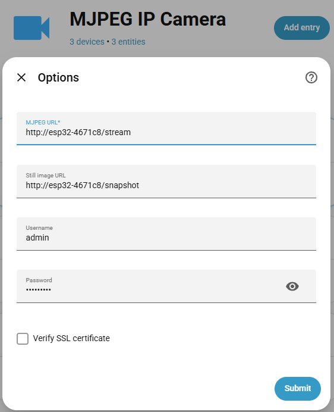

# ESP32 MJPEG Stream Camera

Firmware for AI-Thinker ESP32-CAM (OV3660) with web streaming and camera controls.
This has been specially implemented to work with Home Assistant

## Hardware and Assembly

### Hardware parts

- AI-Thinker ESP32-CAM board with OV3660 camera.
- Stable 5V power source suitable for ESP32-CAM current peaks.

## First setup

On first boot (or if no saved config is found), the device starts in setup mode.

- Setup WiFi AP:
  - SSID: ESP32-CAM-Setup
  - Password: ESP32-CAM
- Open http://192.168.4.1, then complete setup:
  - WiFi network SSID and password
  - Admin password (min 8 characters)
  - Device name (default: ESP32-CAM)
  - You can use the scan button to list nearby WiFi networks.

## Normal Operation

After setup, the device boots into normal operation.

- It tries saved WiFi networks in priority order until one connects.
- Main web interface: port 80 (HTTP Basic Auth, user: `admin`, password: configured admin password).
- Live MJPEG stream endpoint: `/stream` on port 80. The firmware dispatches each viewer to one of two MJPEG worker ports, 81 and 83, so two clients can stream at the same time.
- Direct JPEG snapshot URLs: `/snapshot` or `/snapshot.jpg` on HTTP port 80. These require HTTP Basic Auth.
- Flash LED control URL: `/flashlight` on HTTP port 80. `GET` returns JSON state, and `POST`/`GET` with `enabled=1` or `enabled=0` changes it. This requires HTTP Basic Auth.
- Firmware upload endpoint: HTTP port 82.
- If no saved WiFi connects, it starts fallback AP:
  - SSID: ESP32-CAM
  - Password: current admin password

### Admin page

Use this page for system-level configuration.

- Manage WiFi profiles: add, edit, reorder priority, enable/disable, delete, and scan nearby networks.
- Switch each profile between DHCP and static addressing (IP, gateway, mask, DNS).
- Change admin password.
- Change device name.
- Enable or disable LED blink on URL access.
- Configure WiFi TX power for STA mode and fallback AP mode.
- Upload new firmware (`.bin`) for OTA update.
- Restart device.
- Run factory reset (deletes config and returns to setup mode).

### Camera page

Use this page for live view and manual capture.

- Live MJPEG stream view.
- Use `/stream` for clients that need a direct authenticated stream URL.
- Show/hide stream without leaving the page.
- Use `/snapshot` or `/snapshot.jpg` for a one-shot authenticated JPEG.
- Flash LED on/off via `/flashlight`.
- Camera tuning controls, including:
  - resolution
  - brightness, contrast, saturation
  - JPEG quality
  - special effects
  - white balance options
  - mirror/flip
  - lens correction
  - optional 90-degree view rotation in the browser

### Admin page

Use this page for system-wide settings and maintenance.

- Configure WiFi priority list and credentials.
- Manage admin password and device name.
- Set time manually or request NTP sync.
- Configure LED blink-on-access behavior.

### Setup in Home Assistant

The camera module can be added to HA using the MJPEG IP Camera integration, filling the dialog with the IP/local DNS name and the credentials to access it:

An additional configuration is required to be able to monitor and control the flashlight.

Assuming a `./package` dir exists in the HA configuration directory, and the line:

`packages: !include_dir_named packages`

Exists in `configuration.yaml`.

For each hardware camera module create in the `packages` directory a copy of the [`ha_camera.yaml`](ha_camera.yaml) file, adding a password line to the `secrets.yaml` file:

`espcam_password: <your password>`

Once configured, HA automations can be built to stream and capture video or to capture still images from the camera.

## License

© 2026 Andrea Esuli

[BSD 3-Clause License](LICENSE).
